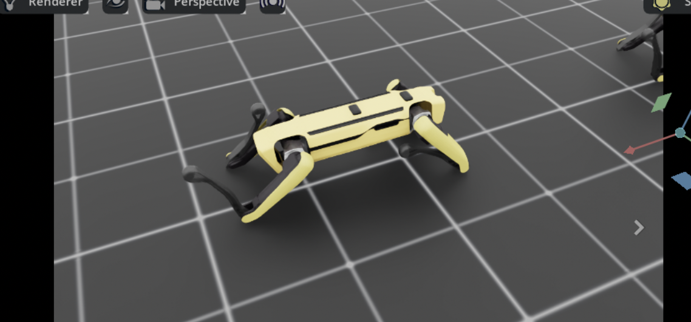
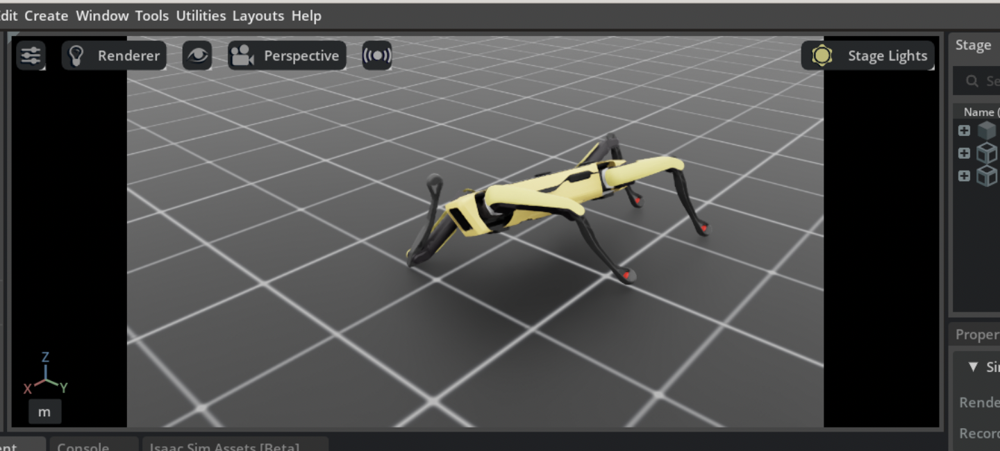
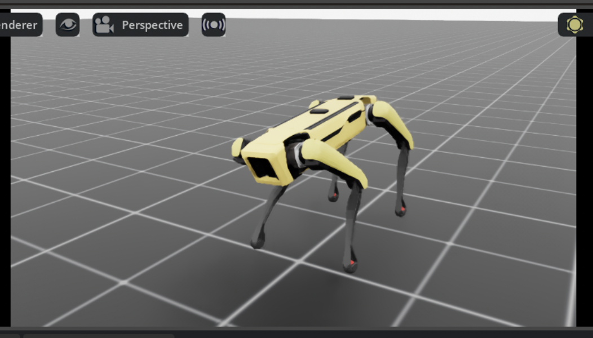
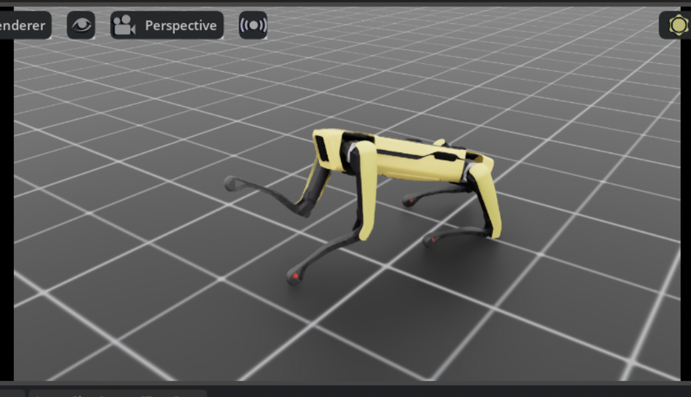
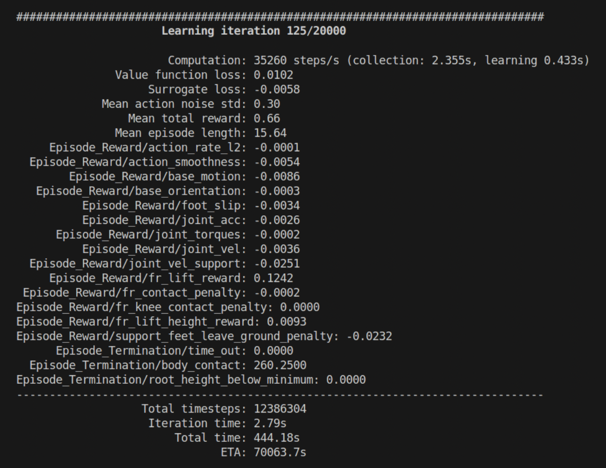

# Daisy Balance Task 

This project explores reinforcement learning (RL) for robotic balance using the Boston Dynamics Spot robot (nicknamed **Daisy**) simulated in NVIDIA IsaacLab. The long-term goal is to teach Daisy to **balance objects on her back**, but the current focus is on the foundational behavior: **learning to balance herself**, particularly on **three legs**.

---

## Current Objective

Before Daisy can carry objects, she must first be able to maintain balance under asymmetric support. This task focuses on training Daisy to **lift her front right (FR) foot off the ground** while using only the remaining three legs to stay upright and stable.

---

## Method Overview

We use a custom environment in IsaacLab and train Daisy with Proximal Policy Optimization (PPO). The environment includes:

- Physics-based simulation with contact and force sensors
- Reward shaping to guide balance and foot lifting
- Termination conditions to stop unstable episodes early

---

## Reward & Penalty Structure

To shape Daisy’s behavior, we designed several reward and penalty terms:

### Rewards
+ **`fr_lift_reward`**: Encourages Daisy to raise her front right foot.
+ **`fr_lift_height_reward`**: Scales positively with how high the foot is lifted, saturating with an exponential curve.
+ **`base_orientation`**: Rewards stable upright posture.
+ **`base_motion`**: Rewards staying in place without excessive translation.

### Penalties
- **`fr_contact_penalty`**: Applied when the front right foot touches the ground.
- **`joint_vel_support`**: Penalizes erratic movement of the supporting legs.
- **`foot_slip`**: Penalizes unintended lateral slipping.
- **`joint_acc`, `joint_torques`, `joint_vel`**: Penalize aggressive or unstable joint behavior.
- **`support_feet_leave_ground_penalty`**: Penalizes when any of the three support feet leave the ground.
- **`action_rate_l2` / `action_smoothness`**: Encourage smoother and more efficient actions.

---

## Progress

I've trained and retrained about 5 times till I got the desired behavior. The last iteration caused her to learn how to get on her knees and raise her right foot in the air because 
the reward for lifting it was much higher than any penalty for keeping her support feet on the ground.

Take #2

And Take #3 is a little better :)

Take #4 shows her standing on three feet but only for about 1 second before she falls over.

And finally Take #5 shows her balanced and raising her front right foot!

I monitor training through a bunch of rewards and penalty functions. An example of the output I see during training is:

I use these metrics to infer whether the robot is learning how I want it to learn. I can also see what weights influence its final score the most and I can tweak them if they don't influence it the way I want them to.

This is how I trained her to stand on three legs!

---

## Next Steps

- Add object balancing once self-balance is mastered
- Improve stability under perturbation
- Tune penalty weights to encourage more natural motion

---

## Credits

Developed with IsaacLab and inspired by the goal of bringing high-mobility robots into human environments in an intelligent, adaptive way.

